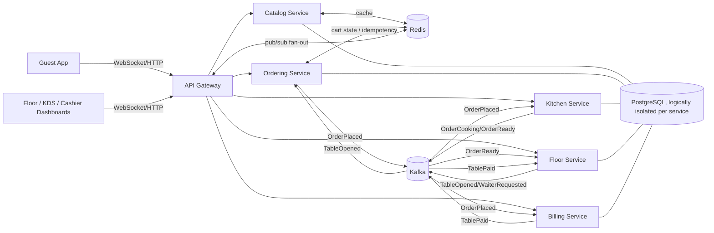
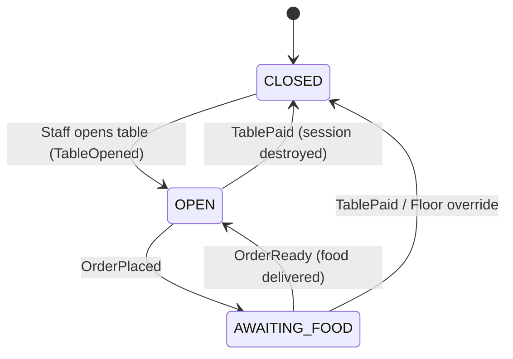

# DineSync — System Architecture & Engineering Specification

> **Status:** Design document for a greenfield build. As of this revision, the repository contains only the monorepo scaffold (`docker-compose.yml`, empty `apps/*` packages, empty `packages/dinesync-types`) — no service code exists yet. This document is the contract all services are built against.

---

## 1. Executive Summary & Problem Statement

### 1.1 The Operational Bottlenecks

Traditional hospitality software suffers from severe operational latency and UX friction:

* **The Waiter Bottleneck:** Relying on physical servers to take and process orders creates lag, limits table turnover, and frustrates guests during peak hours.
* **Group Ordering Chaos:** Verbalizing a shared order for a large group is error-prone. Digital solutions often fail here, forcing guests to pass a single phone around the table.
* **QR Security & Maintenance:** Static QR codes are vulnerable to remote "prank" orders. Conversely, dynamic QR codes require staff to constantly print and replace physical menus, killing adoption.

### 1.2 The DineSync Solution

DineSync is a cloud-native, real-time restaurant orchestration platform. It eliminates the waiter bottleneck by providing a **Session-Activated Collaborative Cart**, allowing guests to scan a static QR code, join a synchronized multiplayer lobby, and submit orders directly to the Kitchen Display System (KDS).

By leveraging an **Event-Driven Architecture (EDA)**, the system guarantees instant updates across the restaurant while remaining resilient to single-point service failures. To ensure rapid time-to-market and avoid PCI-compliance overhead, payment is intentionally scoped out of the guest app and handled via a unified Cashier Dashboard.

---

## 2. Requirement Analysis

### 2.1 Functional Requirements

**Table & Session Management**

* The system must allow staff to change a physical table's status from `CLOSED` to `OPEN`.
* Changing a table to `OPEN` must dynamically generate a unique session ID linked to that table's static QR code.
* The system must reject any QR code scans for tables that are currently marked as `CLOSED`.

**Access Control & The "Party Leader"**

* The system must assign the `LEADER` role to the first user who scans an active QR code.
* The system must place subsequent users who scan the same QR code into a "Waiting Room" state.
* The system must push a real-time notification to the `LEADER` to accept or deny users in the Waiting Room.
* The system must promote the next oldest active user to `LEADER` if the current leader disconnects for more than 30 seconds.

**The Collaborative Cart**

* The system must synchronize cart additions and removals in real-time across all active session members.
* The system must allow the `LEADER` to freeze the cart, preventing other members from making changes while reviewing the final order.
* The system must allow the `LEADER` to unfreeze the cart to return to collaborative mode.

**Order Submission & Billing**

* The system must submit the finalized cart to the Kitchen Display System (KDS) upon `LEADER` confirmation.
* The system must aggregate all submitted orders for a specific table into a running bill on the Cashier Dashboard.
* The system must automatically destroy the active session and reset the table to `CLOSED` when the Cashier marks the bill as paid.

**Kitchen Staff (Kitchen Display System - KDS)**

* The system must provide a real-time dashboard displaying incoming orders, grouped by table number and sorted chronologically.
* The system must allow chefs to transition the state of an entire order ticket (or individual items) through a strict pipeline: `PENDING` → `COOKING` → `READY`.
* The system must emit a `FoodReady` event when a chef marks a ticket as `READY`, instantly notifying the floor staff to run the food to the table.
* The system must handle high-volume event bursts without crashing the UI (list virtualization on the KDS client, backpressure-aware consumers on the backend).

**Waiters & Floor Staff (Floor Dashboard)**

* The system must allow floor staff to view a real-time, top-down grid of all physical tables and their current states (`OPEN`, `CLOSED`, `AWAITING_FOOD`).
* The system must support a "Call Waiter" feature, where a guest tapping a button on their app triggers a real-time visual ping on the floor staff dashboard.
* The system must allow authorized floor staff to manually override and destroy an active session (e.g., if a group walks out).
* The system must allow staff to manually inject items into a table's cart (e.g., verbal orders) and sync this to the guests' devices.

### 2.2 Non-Functional Requirements

* **Idempotency:** The system must prevent duplicate orders if a user rapidly taps the submit button during a poor network connection, including when two taps race each other before the first has finished processing.
* **Service Decoupling:** The Ordering Service must remain operational and capable of taking orders even if the Kitchen Service or Billing Service experiences a critical crash.
* **Real-Time Sync:** Cart updates must reflect on all connected devices within 200 milliseconds, including when a session's members are connected to different horizontally-scaled gateway instances.
* **Event Streaming:** Microservice communication must occur asynchronously via a message broker (Kafka) to prevent HTTP bottlenecking during peak hours. Event consumers must be idempotent, since Kafka delivery is at-least-once.
* **Event Ordering:** Events belonging to the same table/session must be processed in the order they were produced.
* **Role-Based Scoping:** Users with `MEMBER` or `PENDING` sessions must be programmatically blocked from triggering `LEADER` actions, and that authorization must reflect live leader-migration state, not a stale token claim.
* **Network Security:** In production, databases and Kafka brokers must not be reachable from the public internet — only from backend service network identities inside the VPC.
* **Contract Stability:** Kafka event payload shapes are versioned and shared, so producer/consumer services cannot silently drift out of sync.

---

## 3. System Architecture & Domain Boundaries

DineSync strictly adheres to **Domain-Driven Design (DDD)**. Microservices own their specific domain data and communicate purely via asynchronous events.

1. **API Gateway:** The central ingestion point. Handles WebSocket connections, JWT validation, rate limiting, and distributed tracing.
2. **Catalog Service:** Manages the restaurant menu and inventory. Relies heavily on Redis to cache the read-heavy menu payload, with event-driven cache invalidation on menu updates.
3. **Ordering Service:** Owns the collaborative cart, session validation, and order placement. Holds "hot" cart state in Redis for low-latency reads/writes; persists to Postgres only on final submission.
4. **Kitchen Service (KDS):** Manages cooking pipelines. Completely decoupled from guest sessions.
5. **Floor Service:** Manages physical table states (`OPEN` vs `CLOSED`), waiter pings, and QR code session generation. Owns the canonical live session/leader state used for authorization checks.
6. **Billing Service (Cashier Dashboard):** Aggregates order totals in the background via Kafka and manages the final manual checkout flow.

---

## 4. Technology Stack & Tradeoff Justifications

| Component | Selected Technology | Architectural Justification |
| --- | --- | --- |
| **Workspace** | **Turborepo (pnpm)** | Enables atomic commits across microservices, shared UI/TypeScript packages, and ultra-fast cached builds. |
| **Frontends** | **Next.js (App Router) + Zustand** | Fast initial loads (SSR) for the menu; Zustand handles real-time state via WebSockets. |
| **Backend** | **NestJS (TypeScript)** | Provides native support for microservice abstractions, WebSockets, and Kafka transport layers. |
| **Message Broker** | **Apache Kafka (KRaft)** | Provides high-throughput, replayable event streaming without Zookeeper bloat. |
| **Databases** | **PostgreSQL (Logical Isolation)** | Single physical instance with per-service schemas *and* per-service DB roles/grants (a service can only connect with credentials scoped to its own schema). Balances strict microservice boundaries with startup cost-efficiency. Because this is a shared physical SPOF, it's an explicit accepted MVP tradeoff — see §7.4 for the mitigation and split-out path. |
| **Cache / Ephemeral State** | **Redis** | Shields PostgreSQL from concurrent menu fetches during peak dinner rushes; also holds ephemeral "hot" cart state, idempotency keys, live session/leader presence, and backs the WebSocket pub/sub fan-out layer (e.g., a Socket.io Redis adapter) so real-time events reach guests regardless of which gateway instance they're connected to. |
| **Infrastructure** | **AWS ECS Fargate & ALB** | Serverless containers eliminate Kubernetes overhead while proving enterprise cloud competency. |

---

## 5. Advanced Edge-Case Engineering

### 5.1 Session-Activated QR Codes (Security)

Physical QR codes remain static. Security is handled via **Table State**. If a table is `CLOSED` in the Floor Service, scanning the QR code returns a 403. Seating a guest flips the state to `OPEN` and generates a temporary `sessionId` binding to the endpoint.

### 5.2 The "Party Leader" Mechanic (Concurrency)

To prevent malicious local actors from hijacking a cart:

* The first guest receives an identity token (JWT) and is registered as `LEADER` in the Floor Service's live session-state store (Redis).
* Subsequent scanners wait for explicit `LEADER` approval via WebSockets.
* **Leader Migration:** A WebSocket heartbeat timeout (30s) automatically promotes the next oldest member if the leader disconnects.

> **Design correction — role must not live only in the JWT.** A signed JWT is immutable for its lifetime, but leadership can migrate mid-session. If `role: LEADER` were baked into the JWT claims, a demoted or promoted user's permissions couldn't change until the token expired or was reissued, creating a window where a disconnected ex-leader's still-valid token (or a newly-promoted member's stale token) grants the wrong permissions. Instead:
> * The JWT carries only stable identity (`sessionId`, `userId`) and is short-lived / refreshable.
> * Every `LEADER`-gated action is authorized against the live session record in Redis (owned by the Floor Service), which is the single source of truth for "who is leader right now."
> * On migration, the Floor Service updates that record and pushes a WebSocket event to all members — no token reissue is required for the authorization change to take effect immediately.

### 5.3 Optimistic Locking (The "Cart Freeze")

When the Leader taps "Review Order", the cart state changes to `LOCKED`. WebSockets broadcast a freeze state to all members, turning their UI gray to prevent "sniper additions" right before checkout.

### 5.4 Idempotency Keys (Spotty Wi-Fi Protection)

To prevent duplicate orders, the client generates a unique UUID on submission. Naively checking "does this key exist in Redis, and if not, process the request" leaves a race window: two rapid taps can both pass the check before either has finished processing. Instead:

* The API Gateway performs an atomic `SETNX <idempotencyKey> IN_PROGRESS EX <ttl>` against Redis.
* If the key didn't previously exist, this request proceeds to publish the Kafka event, then updates the key to `DONE`.
* If the key already exists (`IN_PROGRESS` or `DONE`), the request short-circuits and returns the original response/`200 OK` without publishing a duplicate event.

### 5.5 Real-Time Fan-Out Across Scaled Instances

Because the API Gateway and Ordering Service are expected to run as multiple horizontally-scaled instances (ECS Fargate tasks behind an ALB), a WebSocket broadcast that only reaches sockets held in one instance's memory is not sufficient — two guests at the same table could land on different instances. All WebSocket gateways use a Redis-backed pub/sub adapter so any instance can broadcast an event to every connected socket for a session, regardless of which instance accepted the connection.

---

## 6. The Event Lifecycle (Kafka Payload Schemas)

The entire restaurant operates on a strictly decoupled event loop. All event payload shapes are defined once as shared TypeScript interfaces in `packages/dinesync-types` and imported by every producer and consumer — this is the versioned contract that prevents services from silently drifting out of sync as the schema evolves. Events for a given table/session are keyed by `tableId` (or `sessionId`) as the Kafka partition key, guaranteeing that a table's events are processed in order by a single consumer within each consumer group.

Because Kafka delivery is at-least-once, every consumer must be idempotent (e.g., the Kitchen Service dedupes `OrderPlaced` by `orderId` before creating a ticket), independent of the API Gateway's client-facing idempotency key from §5.4 — the two protect different hops (client→gateway vs. broker→consumer).

### 6.1 The Setup: `TableOpened`

* **Trigger:** Host seats guests.
* **Producer:** Floor Service → **Consumer:** Ordering Service

### 6.2 The Action: `OrderPlaced`

* **Trigger:** Party Leader locks cart and checks out.
* **Producer:** Ordering Service → **Consumers:** Kitchen Service, Billing Service

### 6.3 Kitchen Pipeline: `OrderCooking` & `OrderReady`

* **Trigger:** Chef interacts with KDS.
* **Producer:** Kitchen Service → **Consumer:** Floor Service (alerts waiters)

### 6.4 The Assist: `WaiterRequested` & `ManualItemAdded`

* **Trigger:** Guest taps "Call Waiter" / Waiter injects an item.
* **Producer:** Ordering Service / Floor Service → **Consumer:** Floor Service / Ordering Service

### 6.5 The Resolution: `TablePaid`

* **Trigger:** Cashier successfully takes manual payment.
* **Producer:** Billing Service → **Consumer:** Floor Service (destroys session, resets QR code)

---

## 7. Observability, Security & Deployment

### 7.1 Distributed Tracing

The API Gateway propagates a W3C Trace Context header (`traceparent`) on every request, forwarding it through Kafka message headers so a single request can be traced end-to-end across isolated service logs (e.g., via Jaeger/Tempo). A human-friendly correlation ID is still surfaced in logs for manual debugging, but the underlying propagation mechanism is the OpenTelemetry-standard header rather than a bespoke one, for compatibility with standard tracing tooling.

### 7.2 Dead Letter Queues (DLQ) & Idempotent Consumers

Messages failing processing 3 times route to a DLQ, preventing infinite retry loops and ensuring other tables' orders are not blocked. Because DLQ + retries mean a message can be redelivered, all consumers must be idempotent (see §6) so a redelivered message never double-applies its effect.

### 7.3 Rate Limiting

Rate limiting is keyed on **session/JWT identity combined with IP**, not IP alone. A single restaurant's guest Wi-Fi is frequently NAT'd behind one public IP, so pure IP-based limiting would throttle unrelated guests sharing that network.

### 7.4 Network Security & Secrets (Production)

* **Local development** (`docker-compose.yml`) runs Postgres, Redis, and Kafka with ports bound to `127.0.0.1` only (not `0.0.0.0`), so they're reachable from the developer's machine but not from other devices on the same network. Credentials are supplied via environment variables with local-only defaults — this file is not a template for production security posture.
* **Production (AWS)** places Postgres, Redis, and Kafka in private subnets with no public route; security groups permit inbound connections only from the ECS Fargate task security group for backend services. Nothing but the ALB is internet-facing.
* **Secrets** (DB credentials, JWT signing keys) are stored in AWS Secrets Manager / SSM Parameter Store and injected into ECS task definitions at runtime — never hardcoded or committed.
* **Postgres SPOF mitigation:** since all services share one physical instance (§4), each service connects with its own least-privilege DB role scoped to its own schema, so a credential or query issue in one service's code cannot read/write another domain's data. If a service's load profile diverges significantly (e.g., Ordering's write volume outgrows the shared instance), it can be split to its own instance without changing any other service, since access was already logically and credential-isolated from day one.

### 7.5 Integration Testing

Utilizing `Testcontainers`, automated tests spin up ephemeral Docker instances of Postgres and Kafka to validate end-to-end event production without fragile mocks.
